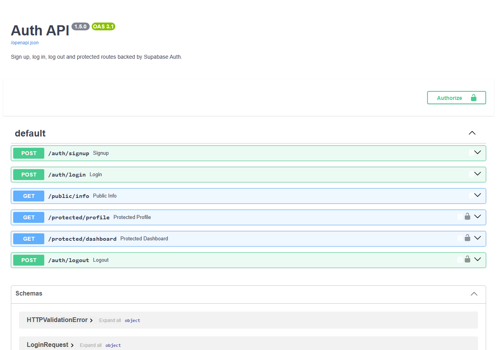

# BE-03 · Auth: Login & Protect

A secure REST API handling **sign up**, **log in** and **log out**, issuing and
verifying JWTs — backed by **Supabase Auth** — and protecting routes behind a
reusable auth middleware. Documented and testable via built-in **Swagger UI**
at `/docs`.

- **Lane:** 🐍 Python — FastAPI + the official `supabase` PyPI package + built-in `/docs`.
- **Developed in stages 0–6**, each committed separately (see `git log`).

---

## What it does

| Route | Auth | Behaviour |
|-------|------|-----------|
| `POST /auth/signup` | public | `{email, password}` → `201` + user; `400` on missing/duplicate |
| `POST /auth/login` | public | `{email, password}` → `200` + `access_token`/`refresh_token`; `401` bad creds |
| `POST /auth/logout` | **protected** | revokes the session (calls `signOut`) → `204` |
| `GET /protected/profile` | **protected** | `200` + user metadata; `401` missing/invalid/expired token |
| `GET /protected/dashboard` | **protected** | `200` + user + dashboard payload (same middleware) |
| `GET /public/info` | public | `200` `{message: "Welcome stranger! This info is public."}` |

The auth logic is extracted into a **reusable dependency**
(`get_current_user` in `app/main.py`), so every protected route is one line.

> **Local testability.** The API talks to Supabase through a thin
> `AuthBackend` interface (`supabase_client.py`). Production uses the real
> Supabase client; running without `SUPABASE_URL`/`SUPABASE_KEY` falls back to
> an in-memory `MockAuthBackend` so the whole suite is verifiable offline.

---

## Setup

1. **Clone** the repo and enter the folder:

   ```bash
   git clone https://github.com/Eldasoky1/FlyRank-assignments.git
   cd FlyRank-assignments/BE-03-auth-login-protect
   ```

2. **Install dependencies** (Python 3.10+):

   ```bash
   python -m venv venv
   venv\Scripts\activate        # or: source venv/bin/activate (Linux/macOS)
   pip install -r requirements.txt
   ```

3. **Configure environment**:

   ```bash
   cp .env.example .env         # then fill in your real values
   ```

4. **Run** (single documented start command):

   ```bash
   uvicorn main:app --reload --port 8000
   ```

   You should see `Server running and connected to Supabase`.

Open **http://localhost:8000/docs** → authorize with a token → "Try it out".

---

## Environment variables

`.env` is **gitignored** (never committed). `.env.example` is the committed template.

| Variable | Required | Purpose |
|----------|----------|---------|
| `SUPABASE_URL` | yes (prod) | `https://<project-ref>.supabase.co` |
| `SUPABASE_KEY` | yes (prod) | anon or service-role key |
| `PORT` | optional | default `8000` |

If `SUPABASE_URL`/`SUPABASE_KEY` are unset, the app uses the in-memory mock
backend — convenient for local testing without a Supabase project.

---

## API reference

| Method | Path | Query/Body | Success | Errors |
|--------|------|-----------|---------|--------|
| POST | `/auth/signup` | `{email, password}` | `201` `{user}` | `400` missing/duplicate, `422` invalid |
| POST | `/auth/login` | `{email, password}` | `200` `{user, access_token, refresh_token}` | `401` bad creds, `422` invalid |
| POST | `/auth/logout` | `Authorization: Bearer <token>` | `204` | `401` |
| GET | `/protected/profile` | `Authorization: Bearer <token>` | `200` `{user}` | `401` |
| GET | `/protected/dashboard` | `Authorization: Bearer <token>` | `200` `{user, dashboard}` | `401` |
| GET | `/public/info` | — | `200` `{message}` | — |

FastAPI also auto-generates `/openapi.json`.

---

## Try it with `curl`

```bash
# signup
curl -s -X POST http://localhost:8000/auth/signup \
  -H 'Content-Type: application/json' \
  -d '{"email":"john@example.com","password":"secret123"}'

# login -> returns access & refresh tokens
curl -s -X POST http://localhost:8000/auth/login \
  -H 'Content-Type: application/json' \
  -d '{"email":"john@example.com","password":"secret123"}'

# access a protected route with the returned token
curl -s http://localhost:8000/protected/profile \
  -H "Authorization: Bearer <access_token>"

# logout (protected)
curl -s -X POST http://localhost:8000/auth/logout \
  -H "Authorization: Bearer <access_token>" -o /dev/null -w "%{http_code}"   # 204

# public route, no auth
curl -s http://localhost:8000/public/info
```

---

## Swagger UI screenshot



To reproduce: run the server, open `/docs`, and the lock icons appear on every
protected route. Click **Authorize** (top-right) → paste your `access_token` →
**Try it out** on any protected endpoint.

---

## Running the tests

```bash
cd BE-03-auth-login-protect
pip install -r requirements.txt
pytest tests/ -q
```

Covers: signup/login status codes, missing vs. wrong credentials, public route,
token verification (missing / bad header / invalid / valid), the shared
middleware on two routes, logout revocation, and the OpenAPI bearer security
scheme. All 19 tests run offline against the mock backend.

---

## Git history (staged commits)

```
Stage 0: setup server and supabase client
Stage 1: signup and login routes working
Stage 2: public route and unverified protected route
Stage 3: profile route token verification
Stage 4: auth middleware and logout endpoint
Stage 5: Swagger UI documentation with bearer auth
Stage 6: publish to GitHub and write README
```

## Bonus: AI vs Me (optional Stage 7)

> A leftover area for a future bonus: have an AI regenerate this same API from
> a from-memory prompt and compare the two implementations in an "AI vs Me"
> section. The staged history above documents exactly how a human builds it
> incrementally; an AI would likely emit the final shape in one shot.
