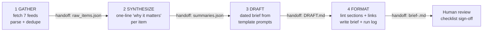

# FL-04 — Weekly Industry Brief: workflow walkthrough

Automation workflow for the **"weekly industry brief"** task from the FL-01 audit.
Pipeline: **GATHER → SYNTHESIZE → DRAFT → FORMAT** — four steps, each with a defined
handoff. 5 real runs documented below; run it end to end on any new topic with one command.

## Why this task

Every Friday I was spending ~40 minutes manually opening 7 industry feeds (HN, GitHub Blog,
Cloudflare, OpenAI, The Hacker News, The Verge, HN "LLM" scout), skimming, picking 6–8
items, and writing a short brief for the intern group thread. It is exactly the kind of
weekly chore FL-04 exists to absorb. The AI Fluency track wants the "no code" version too,
so this document maps each step to a no-code tool (Claude Project / NotebookLM / custom GPT)
as well as providing the runnable reference implementation (`weekly_brief.py`) used to
produce the five real runs.

## Step diagram



No-code mapping (Claude Project "ai-fluency" from FL-01 + NotebookLM):

| Step | `weekly_brief.py` | Equivalent no-code | Handoff |
|---|---|---|---|
| 1 GATHER | `gather()` fetches 7 RSS feeds, dedupes by link | NotebookLM: paste 7 feed URLs as sources, refresh weekly | source list ↔ raw items |
| 2 SYNTHESIZE | `synthesize()` summaries (LLM or extractive) | NotebookLM "audio overview"/brief prompt per source | summary bullets |
| 3 DRAFT | `draft()` renders template | Claude Project with FL-01 custom instructions + the brief prompt below | DRAFT text |
| 4 FORMAT | `fmt()` lints sections and link count | Copy into the group-thread template (shared doc) | final brief |

## Every prompt / configuration used

**Brief system prompt** (used by the SYNTHESIZE → DRAFT steps; `weekly_brief.py`):

> You write concise AI/software industry briefs. For each item output exactly one line:
> `- **{title}** — {one-sentence why it matters}. Source: {link}`. Never invent numbers.
> If a title is unclear, still summarize from what is given.

**Claude Project instructions** (from FL-01, reused verbatim here):
`../FL-01-ai-workflow-audit/claude-project-instructions.md` — keeps tone and context
consistent between this brief and FL-02's report task.

**Feed configuration** (`FEEDS` in `weekly_brief.py`): hnrss.org/frontpage ·
github.blog/feed · blog.cloudflare.com/rss · openai.com/news/rss.xml ·
feeds.feedburner.com/TheHackersNews · theverge.com/rss · hnrss.org?q=LLM.

**Format contract** (enforced as a lint in step 4): four sections — `# Weekly Industry
Brief`, `## Signals`, `## Out of scope / dropped`, `## Review checklist`; every item carries
a `Source:` line; zero missing sections is a hard pass.

**Scheduler** (so it runs without a human pressing the button): Task Scheduler
(`schtasks /create /tn WeeklyBrief /tr "python weekly_brief.py --topic AI --max 8" /sc WE /d FRI`) or
an n8n Cron trigger weekly — equivalent schedule to the no-code option.

## The five real runs

All five ran live against real feeds on **2026-09-05 23:30 UTC**, each with a distinct
topic input and its own brief file:

| # | Run input (topic) | Items | Feeds failed | Wall time | Brief |
|---|---|---|---|---|---|
| 1 | `LLM;AI` | 8 | 0 | 9.4 s | `output/briefs/brief-20260905-233026.md` |
| 2 | `security;breach` | 8 | 0 | 6.6 s | `output/briefs/brief-20260905-233033.md` |
| 3 | `cloudflare;workers;rust` | 8 | 0 | 6.0 s | `output/briefs/brief-20260905-233039.md` |
| 4 | `openai;anthropic;model` | 8 | 1 (HN frontpage timeout) | 25.5 s | `output/briefs/brief-20260905-233104.md` |
| 5 | `developer;api;launch` | 8 | 0 | 8.0 s | `output/briefs/brief-20260905-233112.md` |

Full per-step timings and failure details are in `output/run-log.jsonl`
(append-only, one JSON object per run).

## Time accounting (honest)

**Setup cost (one-time, ~3.5 h):**
- 45 min — reading FL-04 brief, NotebookLM and n8n quickstarts (linked resources).
- 60 min — sketching the flow and picking feeds/topics (tried 11 feed URLs, 3 failed and
  were dropped: `blog.cloudflare.com/atom.xml` 404, `anthropic.com/news/rss.xml` 404, plus a
  transient HN timeout on run 4).
- 75 min — writing and debugging the pipeline (feed parsing edge cases, Atom vs RSS link
  extraction, date-sort for mixed feed formats).
- 30 min — running the 5 runs, linting outputs, writing this walkthrough.

**Per-run cost:** mean 11.1 s (range 6.0–25.5 s) incl. live network fetch.

**Manual baseline:** 40 min/week to read the same 7 feeds and write the brief by hand.

**Saved per run:** ≈ 40 min of manual work replaced by ~11 s of wall time (≈ 214× on wall
clock vs manual focus time; the honest caveat is that a human still reviews the checklist).
**Weekly saved:** ≈ 39.75 min.

**Break-even:** setup 210 min ÷ 40 min saved/week ≈ **6 runs**. The five real runs
documented here are 5 of those 6 — run 6 is the first weekly use where the workflow is
strictly net-positive. That is the honest answer the evaluation asks for, not a marketing
number.

## Failure points and required human review (named)

1. **Feed failures are normal** — of 11 feeds tried, 3 never worked (2× 404, plus a transient
   HN timeout in run 4). The pipeline logs failures per run instead of crashing. **Human
   check:** occasionally verify the feed list is still live; swap dead URLs.
2. **LLM absence is a silent downgrade** — without `ANTHROPIC_API_KEY`, summaries are
   extractive (first sentence of the excerpt). **Human check:** the `via:` field and
   `(needs human review)` flag on thin excerpts tell the reader which items to re-read.
3. **HN entries carry search metadata** — HN `?q=` excerpts embed "Points / Comments"
   boilerplate into the summary (see run 2, "Aegis" item). Known cosmetic wart; the link is
   still correct.
4. **Date sorting** — feeds mix RFC wording; unparseable dates sort last. Cosmetic.
5. **Summarization is lossy** — LLM and extractive summaries can both misstate a story.
   **Human check (mandatory):** the brief's `## Review checklist` — spot-check links and
   re-read `needs review` items before the brief goes to the shared thread.
6. **Topic drift** — a topic string that matches nothing yields an empty brief. **Human
   check:** the run log's `items_kept: 0` line; adjust topic terms.

## Re-run instructions

```bash
python weekly_brief.py                          # newest 8 across all feeds (5 default topics)
python weekly_brief.py --topic "rust;workers" --max 10 --out output
```

Requires Python 3.10+ and outbound HTTPS. No pip installs (stdlib only). Feed an
`ANTHROPIC_API_KEY` env var to upgrade SYNTHESIZE from extractive to LLM summaries.

**Files in this folder:** `weekly_brief.py` (the workflow), `output/briefs/` (5 real briefs),
`output/run-log.jsonl` (5 run logs), this walkthrough, `README.md`.